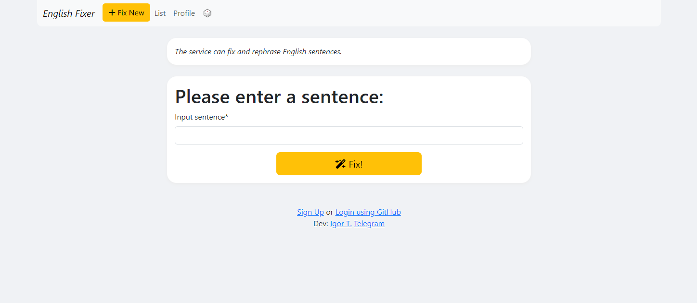
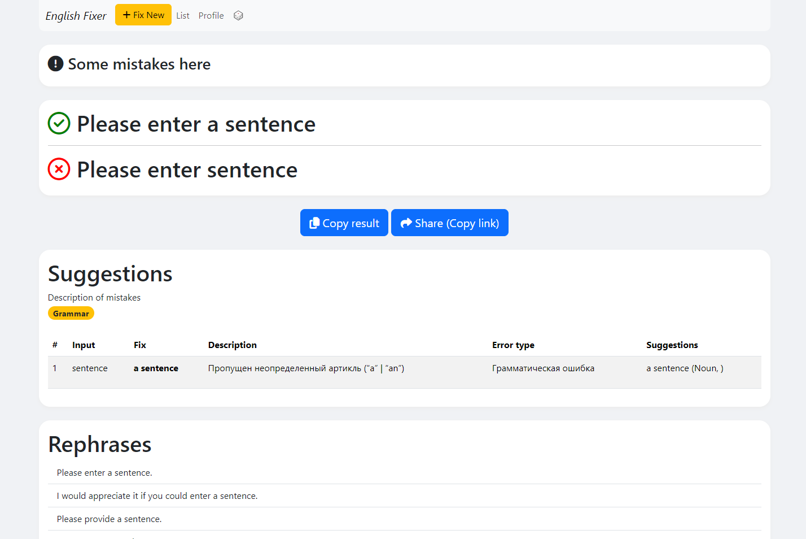
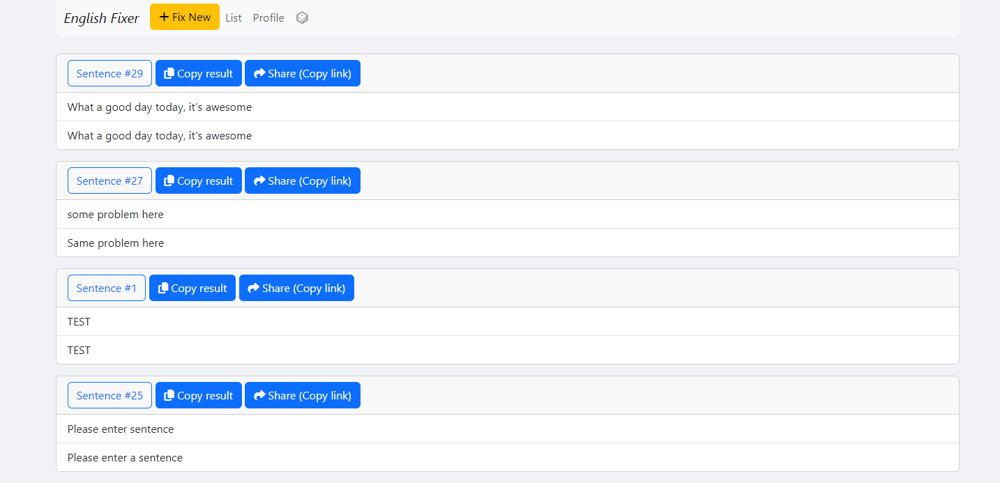
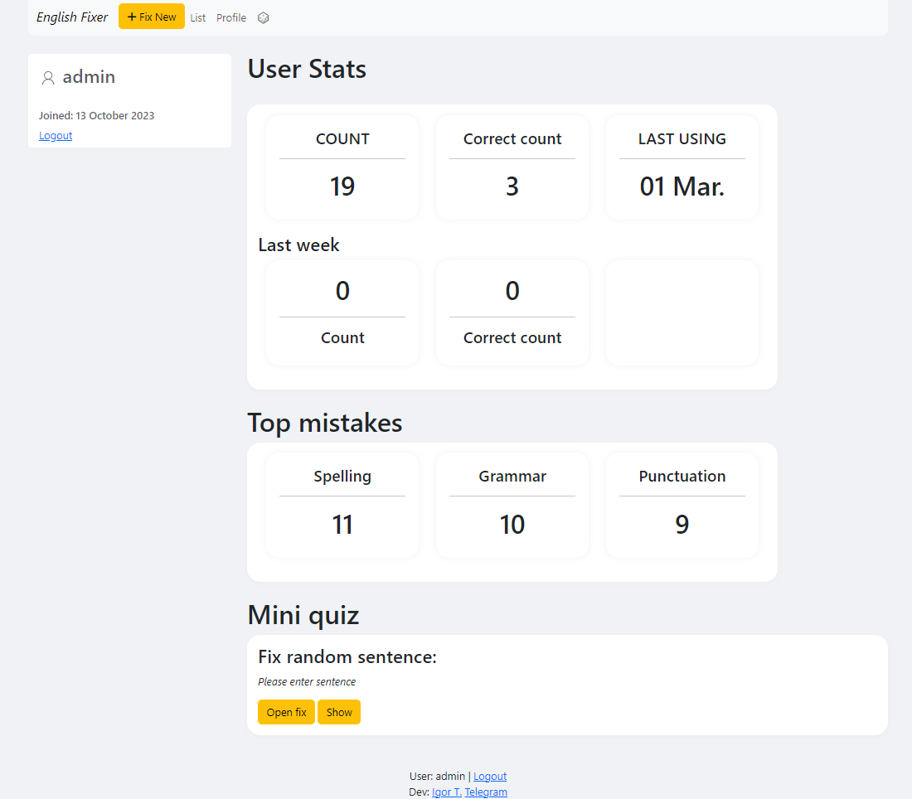

# Project English Fixer

[//]: # (![Python]&#40;https://github.com/AdventurousCake/django_english_project/actions/workflows/python-app.yml/badge.svg?branch=master&#41;)

>⭐ Открыть проект >>> https://engproj9.servehttp.com/

[//]: # (### Открыть проект: link)

Проект English Fixer позволяет исправить ошибки в предложениях на английском, перефразирование предложений используя API reverso.net.
Также предоставляет всю необходимую информацию на одной странице.
Еще можно легко делиться ссылкой на исправленный текст.

### Возможности:
- Исправление ошибок в предложении
- Перефразирование предложений
- Функция перевода
- Сохранение ссылки на фикс + Share link
- Профиль пользователя
- Статистика пользователя
- Статистика запросов
- Мини quiz
- Регистрация и авторизация пользователей + Github Auth
- Unit тесты
- Docker
- Swagger docs (/docs)

### Как запустить
- Создать .env файл
- chmod +x ./entrypoint.sh 
- docker-compose up -d --build
- docker-compose exec web python manage.py migrate --noinput
- docker-compose exec web python manage.py collectstatic --no-input --clear 
- docker-compose exec web python manage.py createsuperuser

---
### Screenshots
### Main page

### Result page

### List page

### Profile page
